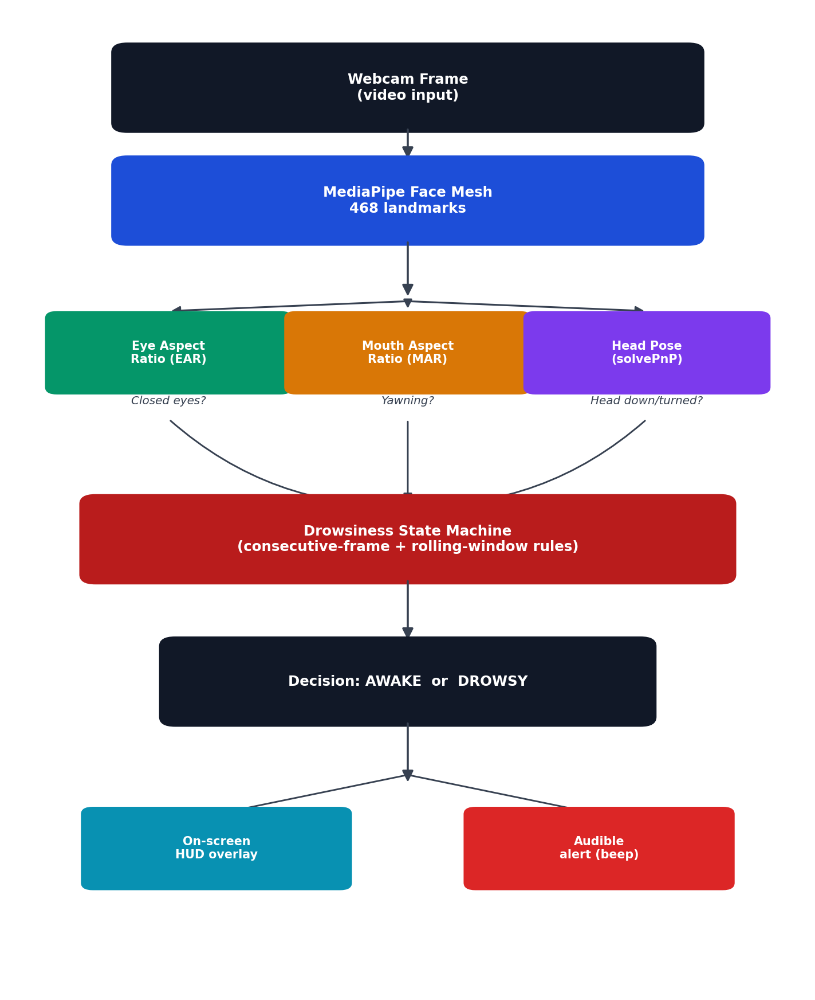

# AI Drowsiness Detection

Real-time driver drowsiness detection using only a webcam — detects **closed eyes**, **yawning**, and **head position** with OpenCV + MediaPipe, and raises an instant visual + audible alert. No cloud calls, no GPU, no wearables.

## About

AI Drowsiness Detection is a real-time driver-fatigue monitoring system built entirely with open-source computer vision, requiring nothing more than a standard webcam. Drowsy driving remains one of the leading causes of road accidents, largely because fatigue builds up gradually and drivers rarely notice it themselves until it is dangerously too late. Existing solutions are usually locked behind expensive, specialized hardware found only in premium vehicles, leaving the vast majority of everyday drivers with no support at all.

This project closes that gap using a lightweight, fully explainable pipeline. Each webcam frame is passed through MediaPipe Face Mesh to extract 468 facial landmarks, from which three simple, well-established fatigue indicators are computed: Eye Aspect Ratio (EAR) to detect sustained eye closure, Mouth Aspect Ratio (MAR) to detect yawning, and head-pose estimation via OpenCV `solvePnP` to detect the head nodding forward. A small state machine combines these three independent signals using consecutive-frame and rolling-window rules, so a single blink or a passing glance never triggers a false alarm, while genuinely sustained drowsiness is caught within about a second and raises an immediate visual and audible alert.

The repository includes the full real-time webcam application, a browser-based live demo with an in-browser siren alert (no installation required), and an offline simulation script that replays a synthetic driving session through the exact same decision logic — useful for testing or demonstrating the system without a camera. Every threshold in the system is a single, named, adjustable variable, making the logic transparent, easy to tune, and easy to explain, rather than relying on an opaque trained classifier.

Built with Python, OpenCV, and MediaPipe, the entire system runs in real time on CPU alone, with no GPU or cloud dependency required.

## How it works

```
Camera Frame
    -> MediaPipe Face Mesh (468 landmarks)
    -> Eye Aspect Ratio (EAR)        -> closed-eye detection
    -> Mouth Aspect Ratio (MAR)      -> yawn detection
    -> Head Pose (solvePnP)          -> head-nod / look-away detection
    -> DrowsinessStateMachine        -> AWAKE / DROWSY decision
    -> On-screen overlay + audible alert
```



## Repository structure

| Path | Description |
|---|---|
| `utils.py` | Core math — EAR / MAR / head-pose calculations and the `DrowsinessStateMachine` decision logic |
| `main.py` | Real-time webcam application (Python) — run this locally with a camera |
| `simulate_demo.py` | Camera-free test harness — feeds a synthetic 60s driving scenario through the real state machine and plots the result |
| `demos/live_camera_demo.html` | Standalone browser demo — uses your **live webcam**, runs entirely client-side, includes a synthesized siren alert |
| `demos/offline_simulation_demo.html` | Standalone browser demo — replays a pre-recorded simulated session, no camera needed |
| `requirements.txt` | Python dependencies |
| `assets/` | Architecture diagram and sample results |

## Quick start (Python / live webcam)

```bash
git clone <this-repo-url>
cd ai-drowsiness-detection
python -m venv venv && source venv/bin/activate   # Windows: venv\Scripts\activate
pip install -r requirements.txt
python main.py
```
Look at the camera normally for ~1 second (calibration), then press `q` to quit.

## Quick start (no install — browser demo)

Just open `demos/live_camera_demo.html` in Chrome or Edge and click **Start camera**. Everything — face detection, decision logic, and the siren alert — runs locally in your browser; no video is ever uploaded.

## Try it without a camera

```bash
python simulate_demo.py
```
Prints every AWAKE → DROWSY transition with the triggering reason and saves a results plot to `assets/simulation_result.png`.

## Tuning

All thresholds live in `DrowsinessStateMachine.__init__` in `utils.py`:

| Parameter | Default | Meaning |
|---|---|---|
| `ear_threshold` | 0.21 | EAR below this = eyes considered closed |
| `ear_consec_frames` | 15 | Consecutive closed-eye frames before alerting (~0.5s @30fps) |
| `mar_threshold` | 0.60 | MAR above this = mouth considered open (yawn) |
| `yawn_count_trigger` | 2 | Yawns within `yawn_window_seconds` before alerting |
| `pitch_drop_threshold` | 15° | Head pitch drop from calibrated baseline before alerting |
| `head_consec_frames` | 20 | Consecutive frames head must stay down before alerting |

## Tech stack

Python · OpenCV · MediaPipe Face Mesh · NumPy · Matplotlib

## Limitations & future work

- Single-face only (`max_num_faces=1`); assumes the driver is in frame.
- Needs reasonable cabin lighting — an IR camera would help for night driving.
- Head-pose model uses generic 3D face proportions, not per-driver calibrated.
- Planned: event logging over a trip, vehicle-speed integration to suppress alerts while parked, embedded deployment (Raspberry Pi).

## License

MIT — free to use, modify, and build on.
